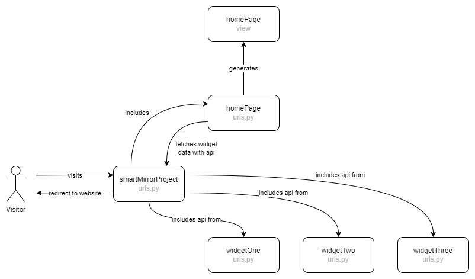

# Add Django app
This project uses Django apps to organise code. This includes both front- and backend code. An app is created for each type of widget. This paragraph describes how one creates such an app and configure it.

>[!IMPORTANT]
> Before following these steps, ensure that your Django-server is installed and configured. You can find the instructions for this in the (development setup docs)[https://github.com/MirrorBoys/TheMirror/blob/main/docs/DEVELOPMENT.md#development-setup].
>[!IMPORTANT]
> Ensure that you are following these steps in your Python environment.

## Name the app
Try to use a generic name such as `mailWidget` instead of `gmailWidget`. This makes it easier to switch API providers without having to rename a lot of files and references. Save this app in a variable so we can use it in the next steps. `templateName` will be used to name the app's template file.
```shell
appName="<name of your app>"
templateName="<type of your app>"
```
>[!NOTE]
> This variable is only created for your current shell. It will be deleted if you exit your shell.

## Create app
In these steps we will use Django's `manage.py` applicaton to create the app and it's folders.

1. Create the app
```shell
python3 ~/TheMirror/src/smartMirrorProject/manage.py startapp $appName
```
2. Add the app to the Django project settings file.
```shell
sudo nano ~/TheMirror/src/smartMirrorProject/smartMirrorProject/settings.py
```

```shell
...
INSTALLED_APPS = [
    'django.contrib.admin',
    'django.contrib.auth',
    'django.contrib.contenttypes',
    'django.contrib.sessions',
    'django.contrib.messages',
    'django.contrib.staticfiles',
    'homePage',
    'musicWidget',
    'newsWidget',
    'travelWidget',
    'weatherWidget',

    # Add the following line
    '<name of your app>',
]
...
```

## Configure app
After creating the app we need to configure it.

### Adding static files
We create the folders and files which will store the static files.
```shell
mkdir -p ~/TheMirror/src/smartMirrorProject/$appName/static/$appName/images/.image-sourcefiles
touch ~/TheMirror/src/smartMirrorProject/$appName/static/$appName/script.js
touch ~/TheMirror/src/smartMirrorProject/$appName/static/$appName/style.css
```

### Adding templates
We create the folders and files which will store the templates.
```shell
mkdir -p ~/TheMirror/src/smartMirrorProject/$appName/templates/$appName/
touch ~/TheMirror/src/smartMirrorProject/$appName/templates/$appName/$templateName.html
```

### Configuring URLs
We create and update the files to configure correct routing. This route depends on the desired functionality of the app but these steps show the general approach. The image below shows an general overview of the URLs in this project.



1. Add URL to smartMirrorProject to include the app's URL.
```shell
sudo nano ~/TheMirror/src/smartMirrorProject/smartMirrorProject/urls.py
```
```shell
...
urlpatterns = [
    path("admin/", admin.site.urls),
    path("", include("homePage.urls")),
    path("musicWidget/", include("musicWidget.urls")),
    path("api/weather/", include("weatherWidget.urls")),
    path("api/news/", include("newsWidget.urls")),

    # Add the following line
    path("api/<name of your app>/", include("<name of your app>.urls")),
]
...
```

2. Create the URL file for the app.
````shell
sudo nano ~/TheMirror/src/smartMirrorProject/$appName/urls.py
````
```shell
...
urlpatterns = [
    # Example URL pattern.
    path("fetch/<str:start_station>/<str:end_station>/<int:amount_trips>", views.fetch_trip, name="apiTravelFetch"),

    # Breakdown of the route:
    # - fetch: indicates that the URL is used to fetch data.
    # - <str:start_station>: a parameter of datatype string is passed to the API.
    # - <str:end_station>: a parameter of datatype string is passed to the API.
    # - and so on.

    # Add your URL pattern here
]
...
```
>[!IMPORTANT]
> This URL is differs per app. The URL should be created based on the desired functionality of the app.

## Add app to homePage
To include your app to the homepage, you need to add it to the `widgets` dictionary in the `views.py` file of the `homePage` app. This dictionary contains all the widgets that are displayed on the homepage.
```shell
sudo nano ~/TheMirror/src/smartMirrorProject/homePage/views.py
```

```python
...
widgets = {
        "weather": {
            "id": 1,
            "type": "weather",
            "data": requests.get(f"http://localhost:8000/api/weather/fetch/{WEATHER_NUMBER_OF_DAYS}", timeout=API_TIMEOUT).json(),
        },

        # Add your app here
...
```

## (re)Start the server
After configuring the app, be sure to (re)start the Django server.
```shell
python3 ~/TheMirror/src/smartMirrorProject/manage.py runserver
```	

## Code
Now that the app is created and configured, we can start writing the code for the app. Generally, you will edit these files:

| File | Description |
|------|-------------|
| `..<app name>/static/<app name>/style.js` | CSS for your app |
| `..<app name>/static/<app name>/script.js` | JavaScript for your app |
| `..<app name>/templates/<app name>/<app type>.html` | Template for your app |
| `..<app name>/views.py` | Function(s) that generate the data that will be passed on to the template |