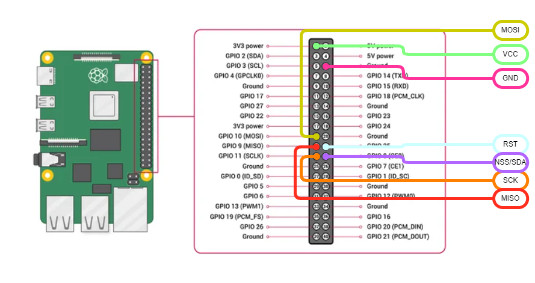

# Hardware
This project uses certain hardware to function. Some examples are the Raspberry Pi and the webcam. This page contains details about all this hardware. 

## Table of contents
- [Raspberry Pi](#raspberry-pi)
- [NFC (Near Field Communication) card reader](#nfc-card-reader)
- [Webcam](#webcam)

## Raspberry Pi
> [!NOTE]
> This information has not been documented yet. Please see [#75](https://github.com/MirrorBoys/TheMirror/issues/75) for the current status of this documentation.

## NFC card reader
The NFC card reader identifies users through an NFC tag. When a user taps their tag against the reader, they are logged in. This tag can be a physical card or embedded within another device, such as a smartphone.

### Specifications
An [RFID module from Joy-It](https://joy-it.net/en/products/SBC-RFID-RC522) is used for this project. This module is equiped with an NXP MFRC-522 chip and communicates through SPI (Serial Peripheral Interface) with the Raspberry Pi. It is capable of reading and writing from and to both RFID and NFC tags. See [NXP's datasheet](https://www.nxp.com/docs/en/data-sheet/MFRC522.pdf) for a complete list of supported tags.

### Installation
The reader is connected to the Raspberry Pi with jumper wires as shown in the following table and picture.

| NFC reader | Raspberry Pi |
|------------|--------------|
| VCC | 3,3 V |
| RST | GPIO 25 |
| GND | GND |
| MISO | GPIO 9 |
| MOSI | GPIO 10 |
| SCK | GPIO 11 |
| NSS | GPIO 8 |
| IRQ | Not connected |

## Webcam
> [!NOTE]
> This information has not been documented yet. Please see [#76](https://github.com/MirrorBoys/TheMirror/issues/76) for the current status of this documentation.
