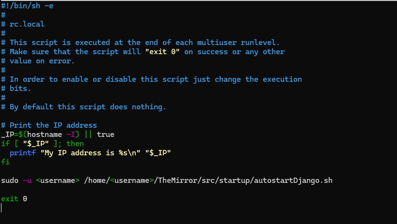

# Auto startup of mirror

## Django 
To automatically start the django server on boot, the script autostartDjango.sh can be used. This script is located in the folder /TheMirror/src/startup.

To use this script you need to do the following: 
1. Open the terminal and navigate to the folder /TheMirror/src/startup.

2. To make the script run on boot, run the following command to add the script to the rc.local file: 
```
sudo nano /etc/rc.local
```
3. Add the following line to the rc.local file before the exit 0 line: 
```
sudo -u <username> /home/<username>/TheMirror/src/startup/autostartDjango.sh
```


4. Save the file and reboot the RPI.

## Kioskmode
To automatically start the RPI in kioskmode, the following things need to be done:

1. Open the autostart file with the following command:
```
sudo nano /etc/xdg/labwc/autostart
```
2. Add the following lines to the file:
```
/usr/bin/lwrespawn /usr/bin/pcmanfm --desktop --profile LXDE-pi &
/usr/bin/lwrespawn /usr/bin/wf-panel-pi &
/usr/bin/kanshi &
/usr/bin/lxsession-xdg-autostart
/usr/bin/lwrespawn /usr/bin/pcmanfm --desktop --profile LXDE-pi &
/usr/bin/lwrespawn /usr/bin/wf-panel-pi &
/usr/bin/kanshi &
/usr/bin/lxsession-xdg-autostart &
chromium = /usr/bin/chromium-browser --start-fullscreen --start-maximized --kiosk --noerrdialogs --disable-default-apps --disable-single-click-autofill --disable-translate-new-ux --disable-translate --disable-cache --disk-cache-dir=/dev/null --disk-cache-size=1 --reduce-security-for-testing --app=http://localhost:8000/theMirror/ 
```	

The following links in this document can be followed to create the scripts necesarry to automatically startup the django server and to put the RPI in kioskmode. 
- [Django](https://forums.raspberrypi.com/viewtopic.php?t=257749)
- [Kioskmode](https://forums.raspberrypi.com/viewtopic.php?t=378883)