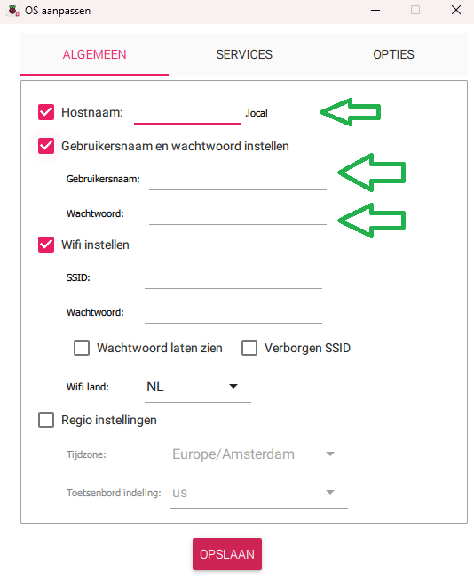
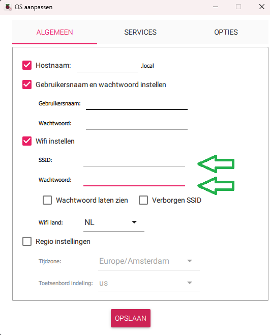
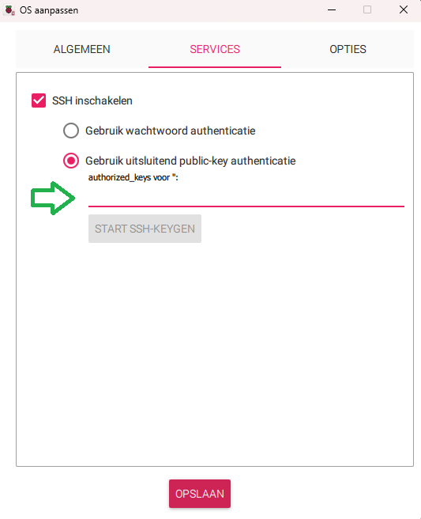
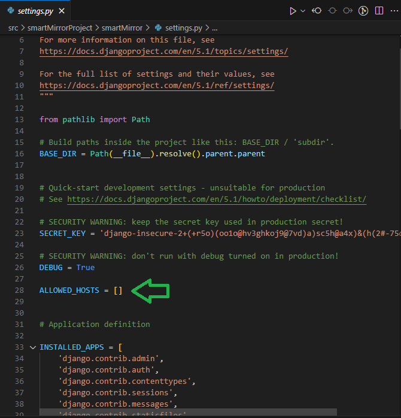

# Raspberry Pi installation documentation
The following document describes the relevant information to make the raspberry pi ready for use. 

## Flashing SD card
To put the os on the SD card the raspberry imager is used 
### OS
The OS that is used is Raspbian Desktop. The desktop version is used because this enables us to use the kiosk mode of the RPI. 

### Hostname, username and password 
Chose a hostname for the RPI and put in the username and password you want to use. 


### wifi (optional)
If you want to use the raspberry over wifi, you can put in the SSID and password of the wifi network you want to use. The RPI will then automatically connect to this wifi network. 



### ssh (optional)

It's also possible to give a ssh key for login during the flashing of the sd card. To do this select the option for ssh key under services and put in your public ssh key.



## Getting ready to use python

### Startup
After the RPI is started and you are connect to the RPI you run the following commands to update the RPI

```
sudo apt update
```
```
sudo apt upgrade -y
```

### Python 

check if a version of Python is installed 
```
python3 --version
```
If not, install Python
```
sudo apt install python3 -y
```

To make it possible to install and use python libaries install pip3 and venv
```
sudo apt install python3-pip python3-venv
```
 
Create a directory for the mirror project and the Python environment
```
mkdir ~/.virtualEnvs/theMirrorEnv
```

Create the Python environment
```
python -m venv ~/.virtualEnvs/theMirrorEnv
```

### Clone repository 
To clone the repository into your home directory
```
cd
git clone https://github.com/MirrorBoys/TheMirror.git
```
this wil create a directory named TheMirror with all the files from Github in it

### Pip
To make it possible to use the different libraries that are in the used in the project the libraries need to be installed into a python environment. 

First start the environment you created
```
source <dir>/bin/activate
``` 

To deactivate the environment:
```
deactivate
```

When you have activated the environment use the requirements.txt to install all required libraries
```
pip install -r ~/TheMirror/src/smartMirrorProject/requirements.txt
```

## All done 

With this the RPI should be ready to be used. If you want run the mirror you can use the following commands to start the webserver: 
```
python manage.py runserver
```
This will start the project and it will be visible from the RPI it is running on. 

To make it so that the webserver can be visited by external devices use the following command 
```
python manage.py runserver 0.0.0.0:8000
```
This can give the error that the IP address of the device needs to be added to the ALLOWED_HOSTS in settings.py


